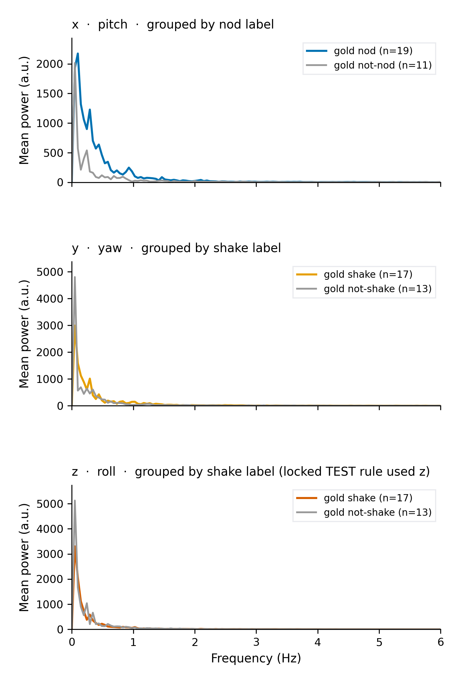
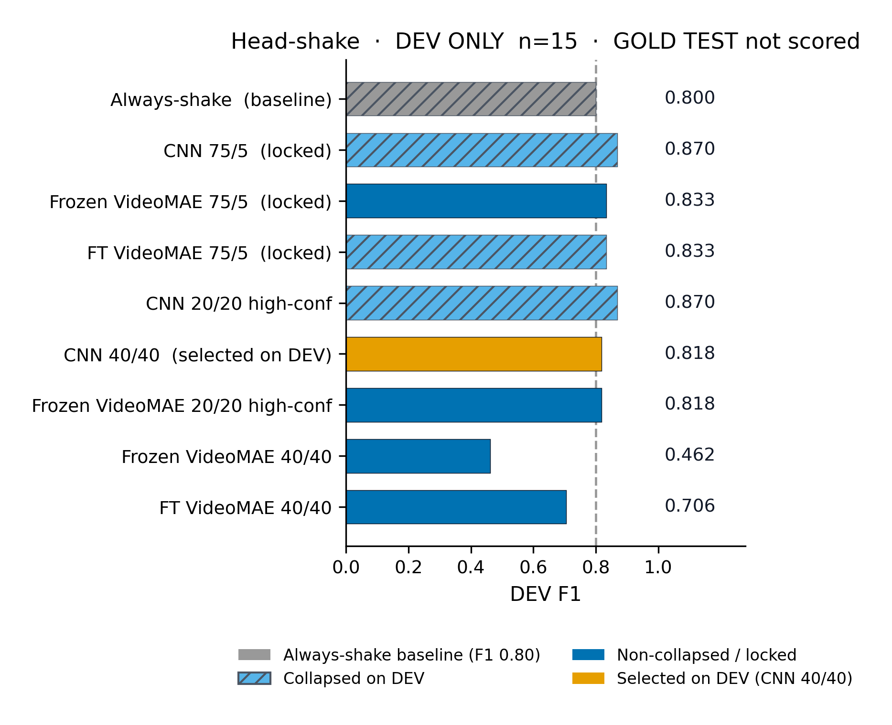
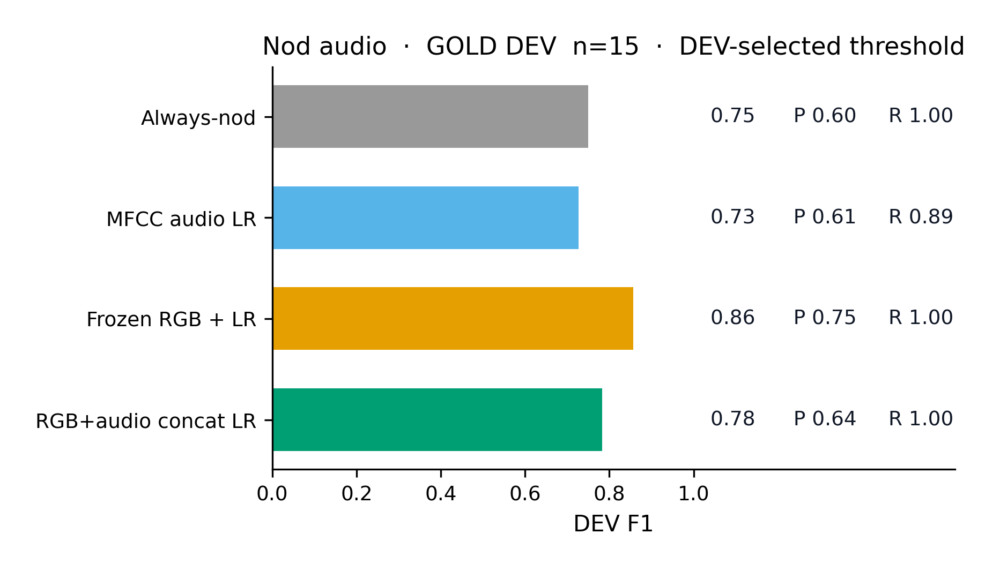
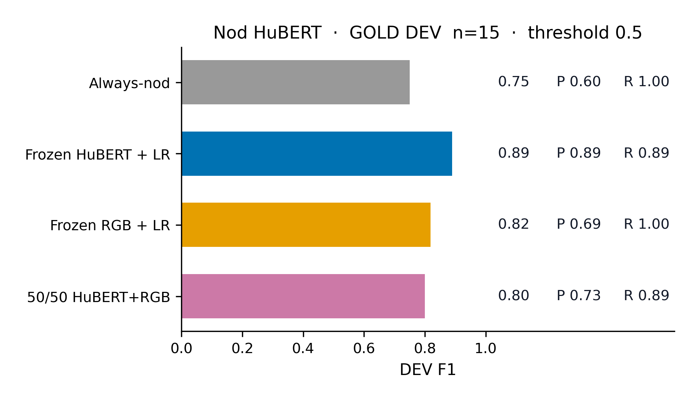

Submitted study: [`dissertation-behaviour-recognition/`](dissertation-behaviour-recognition/).

# Predicting Backchannel Events from Multimodal Conversational Signals

MSc dissertation — Divya Bisht  
Centre for Vision, Speech and Signal Processing (CVSSP), University of Surrey, 2026

Code, gold labels, locked metrics, and figures for **listener head-nod and head-shake recognition** on Columbia RealTalk (Geng et al., 2023).

The package that contains the study is [`dissertation-behaviour-recognition/`](dissertation-behaviour-recognition/).

## Overview

This repository is a systematic study of **visual representations** (3D head pose and RGB video) for binary listener backchannel recognition, with an exploratory **audio-visual** extension on development data only.

- **Task.** Supervised prediction of the backchannel label associated with a conversational window (~60 s). This is **not** anticipatory forecasting from pre-event context.
- **Behaviours.** Head **nod** (primary) and head **shake** (same 30 gold windows, separate `shake_label`).
- **Visual representations.** EMOCA/FLAME Euler pose (used, not trained) and 16-frame RGB face crops → VideoMAE. These are two encodings of the **same camera**, not two sensory modalities.
- **Protocol.** TRAIN = frozen-rule pseudo-labels. DEV = 15 gold windows (tuning). TEST = 15 gold windows, scored **once**. Metric: clip-level precision, recall, F1.
- **Audio.** Mixed conversation soundtrack, GOLD DEV only (`gold_001`–`gold_015`). Includes MFCC LR, concat fusion, and frozen HuBERT. GOLD TEST not scored. Text/transcript models are future work.

**Status.** The agreed experiments are done. Visual nod/shake GOLD TEST is locked (scored once, n = 15). Audio, concat, 50/50 fusion, and HuBERT were run on GOLD DEV only and were **not** scored on TEST.

## Results

### Head-nod TEST (n = 15, scored once)

Canonical result: **fine-tuned VideoMAE, last 4 blocks, 80 pseudo TRAIN, F1 = 0.82**.


| Method | Input | TRAIN | P | R | F1 |
| --- | --- | --- | ---: | ---: | ---: |
| Pose rule (axis **x**, τ = 16.35°) | EMOCA Euler | — | 0.64 | 0.70 | **0.67** |
| Pose 1D CNN | Euler + derivatives | 80 | 0.70 | 0.70 | **0.70** |
| Frozen VideoMAE head | RGB 16-frame crops | 80 | 0.55 | 0.60 | **0.57** |
| Fine-tuned VideoMAE (last 4 blocks) | RGB 16-frame crops | 80 | 0.75 | 0.90 | **0.82** |
| Fine-tuned VideoMAE (scaling) | RGB 16-frame crops | 200 | 0.67 | 0.60 | **0.63** |

95% bootstrap CIs overlap at n = 15 (see `dissertation-behaviour-recognition/results/tables/main_results.md`). No significance claims.

### Head-shake TEST (n = 15, scored once)

Canonical result: **pose rule F1 = 0.70**. RGB did not beat pose. Always-predict-shake is **F1 = 0.64**.


| Method | TRAIN | P | R | F1 |
| --- | --- | ---: | ---: | ---: |
| Pose rule (axis **z**, τ ≈ 11.15°) | — | 0.54 | 1.00 | **0.70** |
| Always-predict-shake | — | 0.47 | 1.00 | **0.64** |
| Pose 1D CNN (75 pos / 5 neg) | 80 | 0.47 | 1.00 | **0.64** |
| Frozen / fine-tuned VideoMAE | 80 | 0.46 | 0.86 | **0.60** |

Locked TEST used Euler **z** (roll). After `as_euler('xyz')`, geometric shake is **y** (yaw) and nod is **x** (pitch). TEST was not rescored after that audit.

### Pose signal (illustration, not a detector)



### Shake further development (GOLD DEV only)

A later balanced-pseudo search (**40 pos / 40 neg**) was tuned on DEV only (`test_scored: false`). Best DEV pose CNN **F1 = 0.818** vs always-shake DEV **F1 = 0.80**. This does **not** replace the locked TEST headline of **0.70**.



### Audio-visual (GOLD DEV only, n = 15)

Exploratory nod experiment on `gold_001`–`gold_015`. Mixed conversation audio. Frozen VideoMAE (no retrain). GOLD TEST was **not** scored. Do not compare these F1s to locked TEST **0.82**. Thresholds in the first table were selected on this same DEV split.



| Method | Threshold | P | R | F1 |
| --- | --- | ---: | ---: | ---: |
| Always-nod | always 1 | 0.60 | 1.00 | **0.75** |
| MFCC + LR | DEV 0.30 | 0.62 | 0.89 | **0.73** |
| Frozen VideoMAE RGB + LR | DEV 0.55 | 0.75 | 1.00 | **0.86** |
| Concat 768-D + 30-D LR | DEV 0.20 | 0.64 | 1.00 | **0.78** |

Table: `dissertation-behaviour-recognition/results/tables/multimodal_ablation.md`.

Frozen HuBERT (`facebook/hubert-base-ls960`, 768-D, 10 s chunks, mean pool; TRAIN = existing 80 pose-derived pseudo-labels; threshold **0.5**). RGB in this second table also uses threshold 0.5 (not the DEV-selected 0.55 above).



| Method | Threshold | P | R | F1 |
| --- | --- | ---: | ---: | ---: |
| Always-nod | always 1 | 0.60 | 1.00 | **0.75** |
| Frozen HuBERT + LR | 0.5 | 0.89 | 0.89 | **0.89** |
| Frozen RGB + LR | 0.5 | 0.69 | 1.00 | **0.82** |
| 50/50 HuBERT+RGB | 0.5 | 0.73 | 0.89 | **0.80** |

Files: `dissertation-behaviour-recognition/results/hubert_dev/`. Captions: `dissertation-behaviour-recognition/figures/paper/CAPTIONS.md` (Figs O–Q).

## Key findings

- For **nods**, adapting the last four VideoMAE blocks on 80 pseudo-labelled windows is the strongest locked TEST system (**F1 0.82**). Adding more rule-based pseudo-labels (n = 200) did not help (**F1 0.63**).
- Pose alone is already usable for nods (rule **0.67**, 1D CNN **0.70**). Frozen VideoMAE without fine-tuning is weaker (**0.57**).
- For **shakes**, the locked TEST winner is a simple pose amplitude rule (**0.70**). VideoMAE is below the **always-shake** baseline (**0.64**). Class imbalance in TRAIN (75/5) is part of that story.
- Euler axis identity matters: nod ≈ pitch **x**, shake ≈ yaw **y**, roll **z**. The locked shake rule used **z**.
- Pose and RGB are **visual representation experiments**. Audio is GOLD DEV only and is not used to choose TEST systems. MFCC/concat (DEV-selected thresholds): always-nod **0.75**, MFCC **0.73**, frozen RGB **0.86**, concat **0.78**. HuBERT at threshold 0.5: HuBERT **0.89**, RGB **0.82**, 50/50 **0.80**.

## Pipeline

1. **Data.** RealTalk ~60 s listener windows; 30 gold clips (15 DEV / 15 TEST). TRAIN = pose-rule pseudo-labels, not gold.
2. **Pose.** Stream EMOCA Euler `rotation_xyz` (used, not trained).
3. **Nod/shake on pose.** DEV-tuned amplitude rule, then 1D CNN.
4. **RGB VideoMAE.** Frozen head, then last-4-block fine-tune (n = 80; n = 200 scaling). Same camera as pose.
5. **Audio, DEV only.** Mixed conversation WAV; MFCC+LR and frozen HuBERT+LR.
6. **Fusion, DEV only.** Concat and 50/50 probability average.
7. **TEST lock.** Visual nod and shake scored once. No audio/fusion TEST files.

## Setup

```bash
cd dissertation-behaviour-recognition
python -m venv .venv
source .venv/bin/activate
pip install -r requirements.txt
pytest -q
```

GPU VideoMAE training used a lab CUDA environment on otter95 (`/scratch`).

## Repository structure

```
dissertation-behaviour-recognition/
├── data/gold/          # 30 human-labelled nod and shake windows
├── data/splits/        # DEV / TEST ids
├── scripts/            # rule, pose CNN, VideoMAE, audio (DEV-only)
├── src/                # metrics, pose CNN, audio I/O
├── results/            # locked json/csv and tables
├── figures/paper/      # dissertation figures (PNG + PDF)
├── reports/            # audits and chapter drafts
├── tests/              # split and label invariants
└── AUDIO_DEV.md        # otter commands for audio alignment / fusion
```

Canonical scripts are listed in [`dissertation-behaviour-recognition/README.md`](dissertation-behaviour-recognition/README.md). Figure captions: [`dissertation-behaviour-recognition/figures/paper/CAPTIONS.md`](dissertation-behaviour-recognition/figures/paper/CAPTIONS.md). Earlier seven-class demo folders live under [`archive/`](archive/).

## Labels

| Value | Meaning |
| --- | --- |
| nod `1` / `0` | Clear nod / unclear or not a nod |
| `shake_label` `1` / `0` | Clear shake / unclear or not a shake |

RealTalk: **p0 = left listener**, **p1 = right listener**, 25 fps.

## Citation

Code and gold labels: see `CITATION.cff` (MIT licence in `LICENSE`).

Columbia RealTalk video, audio, and EMOCA releases are **not redistributed** in this repository. Use of RealTalk follows its own licence: Geng, S., et al. (2023). *RealTalk*. https://realtalk.cs.columbia.edu/
