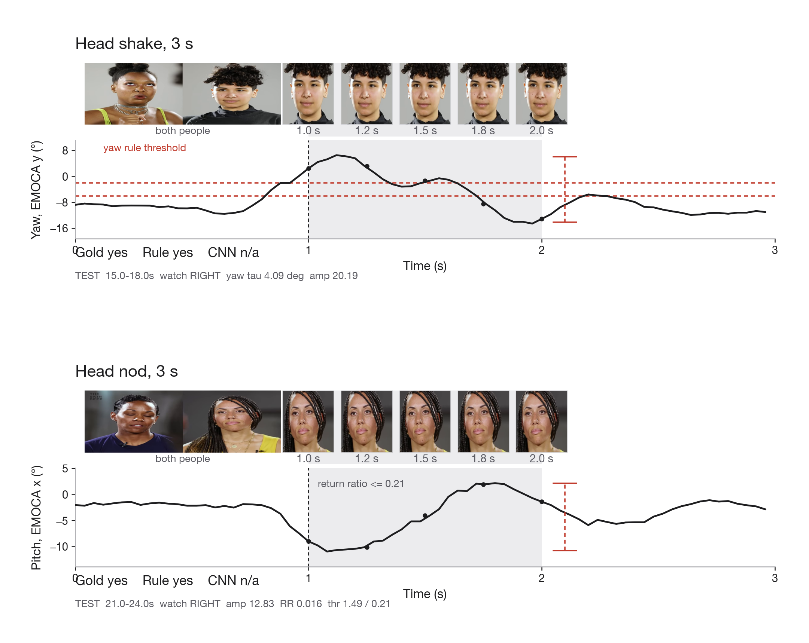

# Predicting Backchannel Events from Multimodal Conversational Signals

[](https://github.com/thelivingdead/multimodalbackchannelprediction/actions/workflows/tests.yml)

MSc dissertation, Divya Bisht  
Centre for Vision, Speech and Signal Processing (CVSSP), University of Surrey, 2026

This repository recognises two listener backchannels on 30 gold clips from Columbia [RealTalk](https://realtalk.cs.columbia.edu/) (Geng et al., 2023): **head shake** (yaw) and **head nod** (pitch). The approved title says prediction. The executed task is recognition of a behaviour inside an observed window, not anticipatory forecasting.

An earlier study gave each clip one 60 s nod label. The thesis results use a 3 s windowed protocol for **both** shake and nod on the same clips.



Two labelled 3 s TEST windows: listener faces plus the matching Euler trace. Top: **head shake**, `gold_023`, 15 to 18 s, yaw (EMOCA y). Bottom: **head nod**, `gold_030`, 21 to 24 s, pitch (EMOCA x). Listener crops are the official RealTalk box for the gold person. Withdrawn largest-face Haar crops are not used. The TEST numbers below are 15-clip balanced accuracies, not these two windows alone.

## Locked TEST headlines

Protocol: 3 s windows, 2 s stride, 29 windows per clip, 435 windows per split. DEV is `gold_001` to `gold_015`. TEST is `gold_016` to `gold_030`. The headline metric is balanced accuracy. Chance is 0.500. The 95% intervals are clip-level bootstrap (15 clips, 2000 resamples). An interval that includes 0.500 is not distinguished from chance.

### Head shake

| System | Axis | TEST balanced accuracy | 95% CI |
| --- | --- | ---: | --- |
| Yaw amplitude rule (frozen) | y, τ = 4.091° | **0.654** | [0.525, 0.794] |

Shake is a larger left to right rotation. The yaw rule is the first result that clears chance on locked TEST. Source: `results/windowed_shake/baselines_bacc/metrics.json`.

### Head nod

| System | Axis | TEST balanced accuracy | 95% CI |
| --- | --- | ---: | --- |
| Return-ratio rule (amplitude plus return) | x | **0.634** | [0.576, 0.685] |
| Amplitude only | x | 0.549 | [0.480, 0.619] |

Nod is a small up and down motion. The return-ratio rule requires the head to come back after the pitch excursion. Amplitude only includes chance. Sources: `results/windowed_test/rule_return_ratio_final/metrics.json` and `results/windowed_nod/baselines_bacc/metrics.json`.

## DEV only (TEST not implied)

These numbers are DEV (`gold_001` to `gold_015`) only.

- Shake Pose CNN balanced accuracy 0.606 [0.519, 0.680]. TEST was not scored.
- Nod Pose CNN balanced accuracy 0.523. The clip-level interval includes 0.500.
- Identity-fixed nod VideoMAE, 1.5 s windows, last two blocks, no horizontal flip: balanced accuracy 0.571. TEST was not scored.
- Largest-face Haar RGB crops were withdrawn because they often showed the wrong person. Later RGB work uses identity-fixed crops only.

A DEV nod fusion search (return-ratio rule, Pose CNN, and 1.5 s VideoMAE) did not beat the return-ratio rule. Fusion, the nod Pose CNN, and the nod VideoMAE runs that stay at chance were not scored on TEST. The shake Pose CNN was also not scored on TEST.

## Dataset and annotation

- **Dataset:** Columbia RealTalk. Videos are not redistributed here.
- **Gold set:** 30 human-labelled listener clips, 15 DEV and 15 TEST, disjoint by `sample_id` and `video_id`.
- **Window labels:** a 3 s window is positive if it overlaps a hand-annotated nod or shake event.
- **Behaviours:** nod and shake on the same clips.
- **Signals:** EMOCA/FLAME head pose (Euler) and RGB face crops. These are two encodings of one camera, not two independent senses.

## Method

```text
Manual event annotation          30 clips (DEV / TEST)
        ↓
3 s windows, 2 s stride          29 windows per clip, 435 per split
        ↓
Pose extraction                  EMOCA Euler, used not trained
        ↓
Rule baselines                   DEV-tuned amplitude and return ratio
        ↓
Pose CNN / VideoMAE              DEV diagnostics where noted
        ↓
Locked TEST                      15 clips, scored once per system
```

Gold DEV and TEST carry human labels throughout. TEST targets are always human.

## Experimental protocol

| Split | Clips | Windows | Role |
| --- | ---: | ---: | --- |
| DEV | 15 (`gold_001` to `gold_015`) | 435 | Axis, threshold, and model selection |
| TEST | 15 (`gold_016` to `gold_030`) | 435 | Scored once, never used to choose models |

TEST is small enough that one clip moves the score. Interval estimates resample whole clips because neighbouring windows overlap by 1 s.

## Repository structure

Study package: [`dissertation-behaviour-recognition/`](dissertation-behaviour-recognition/).

```
dissertation-behaviour-recognition/
├── data/gold/                 human clip labels
├── data/windowed_annotations/ 3 s window labels and event clocks
├── scripts/                   see scripts/README.md
├── src/                       metrics, pose CNN, audio I/O
├── results/                   locked json/csv (do not overwrite TEST dirs)
├── figures/paper/             dissertation and README figures
├── reports/                   audits and chapter drafts
└── tests/                     split, lock, and label invariants
```

## Reproduction

Saved features and prediction CSVs are included where permitted, so the metrics can be recomputed without the videos. Full end-to-end training needs authorised RealTalk access. Raw-data reproducibility is therefore partial, and the repository does not claim otherwise.

Lightweight validation, with no training and no TEST inference:

```bash
cd dissertation-behaviour-recognition
python -m venv .venv
source .venv/bin/activate
pip install -r requirements.txt
pytest -q
python scripts/check_split_leakage.py
```

Do not overwrite the locked result directories.

Canonical scripts: [`scripts/README.md`](dissertation-behaviour-recognition/scripts/README.md). Figure captions: [`figures/paper/CAPTIONS.md`](dissertation-behaviour-recognition/figures/paper/CAPTIONS.md).

## Limitations

- TEST is 15 clips. Clip-level intervals are wide.
- Pose and RGB share one camera.
- Nod Pose CNN, nod VideoMAE, and fusion stay on DEV unless a locked TEST file exists for that system.
- Largest-face Haar crops are withdrawn and must not be treated as listener RGB.

## Ethics, dataset, licensing

Code and gold tables are MIT licensed, see `LICENSE`. Cite this work via `CITATION.cff`.

Columbia RealTalk video, audio, and EMOCA releases are not in this repository. Use of RealTalk follows its own terms: Geng et al. (2023), https://realtalk.cs.columbia.edu/

Some figures include cropped listener faces from RealTalk. Redistribution of those stills is governed by the RealTalk terms and is not licensed from this repository.

## Citation

See `CITATION.cff`. RealTalk: Geng, S., et al. (2023). *RealTalk*. https://realtalk.cs.columbia.edu/
