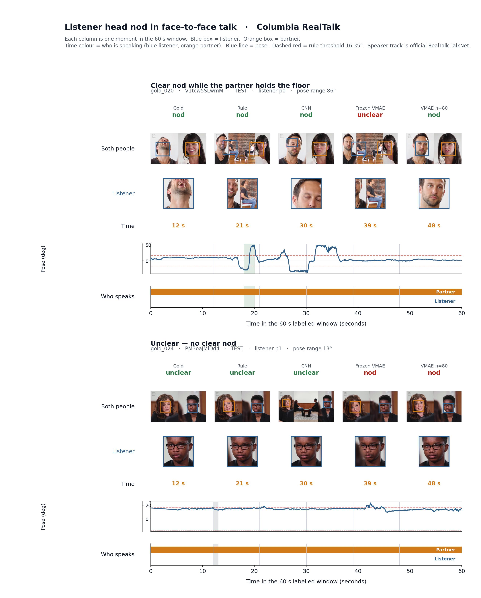
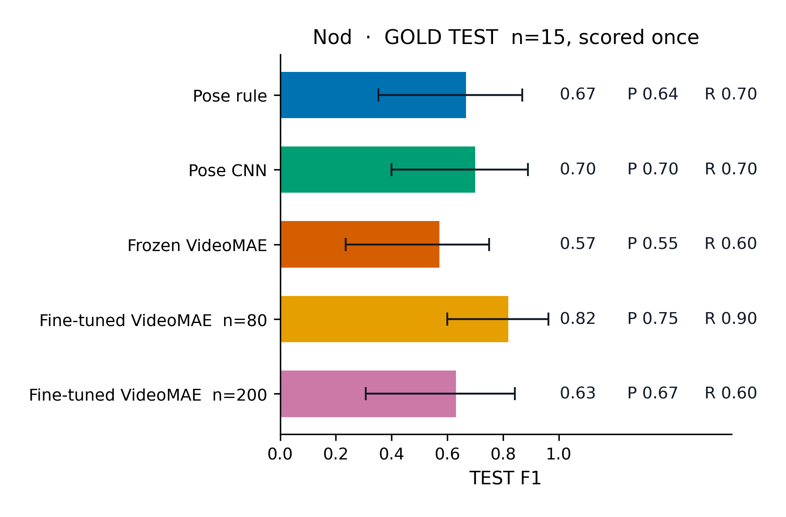
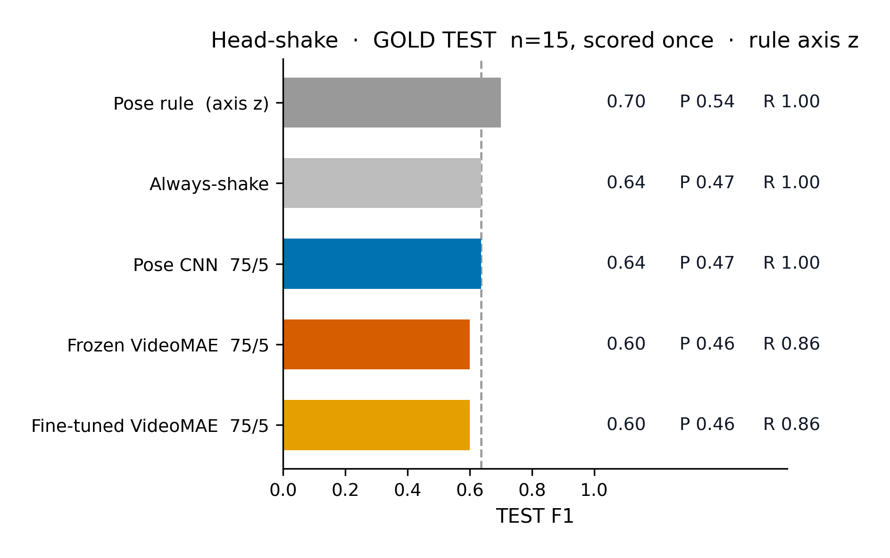

# Predicting Backchannel Events from Multimodal Conversational Signals

MSc dissertation — Divya Bisht  
Centre for Vision, Speech and Signal Processing (CVSSP), University of Surrey, 2026

This repository recognises **listener head nods** (primary) and **head shakes** in ~60 s conversational windows from Columbia [RealTalk](https://realtalk.cs.columbia.edu/) (Geng et al., 2023). It is **clip-level behaviour recognition**, not anticipatory forecasting of a future backchannel.



Two locked TEST windows (listener in blue, partner in orange). Top: `gold_020`, labelled clear nod. Bottom: `gold_024`, labelled unclear. Pose trace is EMOCA rotation x with the frozen nod-rule threshold 16.35°.

**Headline (locked GOLD TEST, n = 15, scored once):** fine-tuned VideoMAE, last 4 blocks, 80 pseudo-labelled TRAIN clips, **F1 = 0.82**.



| Model | TEST F1 |
| --- | ---: |
| Pose rule | 0.67 |
| Pose CNN | 0.70 |
| Frozen VideoMAE | 0.57 |
| Fine-tuned VideoMAE | **0.82** |

n = 15. 95% bootstrap CIs overlap. No significance claims. Full table: [`dissertation-behaviour-recognition/results/tables/main_results.md`](dissertation-behaviour-recognition/results/tables/main_results.md).

---

## Why this problem matters

Listener nods and shakes are backchannel cues. Automatic recognition supports conversational agents and analysis of dyadic talk. The practical constraint here is **few gold labels**: a pose rule supplies noisy **pseudo-labels** on TRAIN; models are selected on 15 DEV windows; **TEST is locked** and scored once.

## Dataset and annotation

- **Dataset:** Columbia RealTalk. Videos are **not redistributed**.
- **Gold set:** 30 human-labelled ~60 s listener windows (15 DEV / 15 TEST), disjoint by `sample_id` and `video_id`.
- **Behaviours:** nod `label` 1/0; shake `shake_label` 1/0 on the same windows.
- **TRAIN:** 80 (later 200) **rule-derived pseudo-labels**, not gold.
- **Signals:** EMOCA/FLAME head **pose** (Euler) and **RGB** 16-frame face crops. These are two encodings of the **same camera**, not two independent senses. **Audio** is mixed conversation soundtrack and is used on **GOLD DEV only**.

## Method

```text
Manual gold annotation          30 windows (DEV/TEST)
        ↓
Pose extraction                 EMOCA Euler, used not trained
        ↓
Rule-based pose baseline        DEV-tuned, TEST once
        ↓
Pseudo-labels on TRAIN          frozen rule on unlabelled clips
        ↓
Temporal pose CNN               TRAIN=pseudo, DEV select; TEST once
        ↓
Frozen VideoMAE baseline        RGB crops, frozen encoder
        ↓
Fine-tuned VideoMAE             last 4 blocks, n=80 headline
        ↓
Audio / multimodal DEV          MFCC, HuBERT, fusion (DEV only)
        ↓
Locked TEST evaluation          n=15, scored once per system
```

Weak supervision: gold DEV/TEST stay human labels; TRAIN uses the pose rule as a noisy teacher. TEST targets are never pseudo-labels.

## Experimental protocol

| Split | n | Role |
| --- | ---: | --- |
| TRAIN | 80 (200 ablation) | Pseudo-labels from the frozen pose rule |
| DEV | 15 gold | Axis, threshold, epoch, probability threshold |
| TEST | 15 gold | Scored **once**. Not used to choose models |

TEST is small. Interval estimates live in `results/tables/bootstrap_ci.csv`. Do not treat point F1 as statistically significant.

## Canonical TEST results (nod)

| Model | Input | TRAIN | P | R | F1 |
| --- | --- | ---: | ---: | ---: | ---: |
| Pose rule (axis x, τ = 16.35°) | EMOCA Euler | — | 0.64 | 0.70 | **0.67** |
| Pose 1D CNN | Euler + derivatives | 80 | 0.70 | 0.70 | **0.70** |
| Frozen VideoMAE head | RGB 16-frame crops | 80 | 0.55 | 0.60 | **0.57** |
| Fine-tuned VideoMAE (last 4 blocks) | RGB 16-frame crops | 80 | 0.75 | 0.90 | **0.82** |

Canonical RGB result: **n = 80, F1 = 0.82**. Sources: `results/rule_test_metrics.json`, `results/classifier_test_metrics.json`, `results/videomae_frozen_head/metrics.json`, `results/videomae_finetuned/metrics.json`.

### Ablation: n = 80 vs n = 200

The same fine-tune recipe with 200 pseudo-labelled TRAIN clips scored TEST F1 **0.63**. Increasing the pseudo-labelled set did not monotonically improve performance. One **plausible** explanation is that extra rule labels also added teacher noise. Given n = 15 TEST, treat this as an observed trend, not a proven causal claim. Artefacts: `results/videomae_finetuned_n200/`.

## Head-shake TEST (n = 15, scored once)

Canonical shake result: **pose rule F1 = 0.70** (always-shake **0.64**). RGB did not beat pose.



Locked TEST used Euler **z** (roll), τ ≈ 11.15°. A later coordinate audit found that after `as_euler('xyz')`, geometric left–right shake is primarily **y** (yaw) and nod is **x** (pitch). TEST had already been scored, so the historical z-axis result was **kept** and **not rescored**. Full audit: `results/shake/dev_search/axis_audit.md` and `reports/annotation_audit.md` (nod timing caveats).

## DEV multimodal experiments (not TEST)

Audio, concat fusion, and frozen HuBERT were run on `gold_001`–`gold_015` only. Scripts refuse GOLD TEST. **Do not read DEV F1 as the system headline.** Tables: `dissertation-behaviour-recognition/results/tables/multimodal_ablation.md`.

A DEV-only timing check of the nod rule vs annotated onsets is in `results/temporal_dev/` (not event-detection F1; annotations mark one gesture per window).

## Repository structure

Study package: [`dissertation-behaviour-recognition/`](dissertation-behaviour-recognition/).

```
dissertation-behaviour-recognition/
├── data/gold/          human labels
├── scripts/            see scripts/README.md
├── src/                metrics, pose CNN, audio I/O
├── results/            locked json/csv (do not overwrite TEST dirs)
├── figures/paper/      dissertation figures
├── reports/            audits and chapter drafts
└── tests/              split, lock, and label invariants
archive/                superseded demos and preflight notes
```

## Reproduction

Saved features and prediction CSVs are included where permitted so **metrics can be recomputed without the videos**. Full end-to-end training needs authorised RealTalk access and (for VideoMAE fine-tune) a GPU environment. This is **not** a claim of full raw-data reproducibility.

**Lightweight validation** (no training, no TEST inference):

```bash
cd dissertation-behaviour-recognition
python -m venv .venv
source .venv/bin/activate
pip install -r requirements.txt
pytest -q
python scripts/check_split_leakage.py
```

`reports/repository_validation.md` recomputes clip F1 from stored TEST prediction CSVs.

**VideoMAE** (optional, expensive; do not overwrite locked dirs):

```bash
pip install -r requirements-video.txt
```

**Audio DEV extras:** `pip install -r requirements-audio.txt`.

Canonical scripts: [`dissertation-behaviour-recognition/scripts/README.md`](dissertation-behaviour-recognition/scripts/README.md).

## Validation

- TEST lock: `scripts/check_split_leakage.py` (`LOCKED_OUT_DIRS` includes nod/shake/joint VideoMAE TEST dirs).
- Split leakage: `reports/split_integrity.md`.
- Metric consistency: `reports/repository_validation.md`.
- Figure captions: `dissertation-behaviour-recognition/figures/paper/CAPTIONS.md`.

## Limitations

- TEST n = 15; CIs overlap; no significance claims.
- TRAIN labels are weak (rule teacher); n = 200 did not help.
- Pose and RGB share one camera.
- Audio/fusion is DEV-only.
- Locked shake TEST used roll (z), not yaw (y).
- Two gold nod clocks sit outside the analysed window (`reports/annotation_audit.md`); labels were not silently repaired.

## Ethics, dataset, licensing

Code and gold tables: MIT (`LICENSE`). Cite this work via `CITATION.cff`.

Columbia RealTalk video, audio, and EMOCA releases are **not** in this repository. Use of RealTalk follows its own terms: Geng et al. (2023), https://realtalk.cs.columbia.edu/

Some figures include cropped listener faces from RealTalk. Public redistribution of those stills is **not independently licensed here**. Prefer pose traces and aggregate plots if a venue forbids identifiable frames. **TODO:** confirm RealTalk terms before using face-crop figures outside the marked dissertation.

## Citation

See `CITATION.cff`. RealTalk: Geng, S., et al. (2023). *RealTalk*. https://realtalk.cs.columbia.edu/
