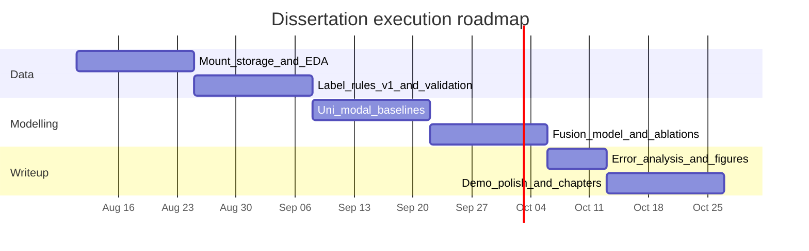

# Research Methodology and Roadmap

**Project:** Multimodal fine-grained backchannel behaviour prediction  
**Primary data:** Columbia RealTalk (Geng et al., 2023)  
**Taxonomy:** 7 classes — `nod`, `shake`, `tilt`, `lean_forward`, `lean_back`, `eyebrow_raise`, `neutral`  
**Key baseline literature:** MM-F2F (Lin et al., ACL 2025; arXiv:2505.12654)

---

## 1. Research questions

1. **RQ1 (Labelling):** Can rule-based detectors on FLAME/EMOCA parameters produce a sufficiently precise 7-class backchannel event set for supervised learning (target: ≥ 0.85 precision on non-neutral classes after hand validation)?
2. **RQ2 (Multimodal prediction):** Does fusing text, audio, video, and FLAME sequences improve macro-F1 over the best uni-modal model for fine-grained BC typing?
3. **RQ3 (Cue specialisation):** Which modalities contribute most to which classes (e.g. audio for vocal BC context, FLAME for nod/shake, text for discourse position)?
4. **RQ4 (Robustness):** How does performance degrade under missing modalities (modality dropout), and does Random Modality Dropout Training (RMDT-style) recover usable bi-modal performance?

---

## 2. Objectives and contributions

| Objective | Intended contribution |
| --- | --- |
| Derive fine-grained BC labels from RealTalk FLAME | Open methodology + validated label protocol (binary BC → typed BC) |
| Build multimodal 7-class predictor | End-to-end architecture with LMF-style flexible fusion |
| Benchmark against strong baselines | Uni-modal, concat fusion, MM-F2F-style coarse transfer |
| Demo system | BackchannelAI website + API for qualitative inspection |

---

## 3. Methodology

### 3.1 Data access, ethics, and storage

1. Request / confirm RealTalk licence and university storage quota.
2. Store raw media on restricted server disk; keep derived features (HuBERT, BERT, FLAME windows) in a fast cache (`parquet` / `npz` / `HDF5`).
3. Do not attempt identity re-identification; follow dataset terms.
4. Log preprocessing versions (`labels_v1`, feature extractor commit hashes).

**Split protocol (speaker-aware):**

- Split by **video / dyad ID** (never by random windows only) to reduce leakage.
- Suggested ratio: **70% train / 15% val / 15% test**.
- Stratify as far as possible on rare classes at the video level.

### 3.2 Automatic label generation + validation

**Pipeline**

1. Load per-frame FLAME pose (axis-angle → pitch/yaw/roll) and expression / brow proxies.
2. Sliding windows (e.g. 0.5–1.0 s, hop 0.1–0.2 s) on **listener** tracks when active-speaker marks the other person as speaking.
3. Apply deterministic rules (`api/label_rules.py` / notebook parity):
   - **Nod:** band-pass pitch ~1–3 Hz; ≥2 peaks/cycles
   - **Shake:** oscillatory yaw
   - **Tilt:** roll magnitude
   - **Lean forward/back:** signed translation
   - **Eyebrow raise:** expression threshold
   - **Neutral:** else
4. Resolve multi-fire conflicts with documented priority.
5. Hand-validate stratified sample (200–400 windows); compute precision/recall vs human.
6. Freeze **labels_v1** for all modelling; later optional **labels_v2** after threshold retune.

### 3.3 Feature / encoder pipeline

| Stream | Backbone (default) | Input | Output |
| --- | --- | --- | --- |
| Text | BERT or GPT-2 last-token style | ASR context window | \(z_T \in \mathbb{R}^{256}\) |
| Audio | HuBERT | Waveform of window (+ context) | \(z_A \in \mathbb{R}^{256}\) |
| Video | VideoMAE (face crop) | Last \(n\) frames | \(z_V \in \mathbb{R}^{256}\) |
| FLAME | Transformer / 1D CNN over params | Pose+expression sequence | \(z_F \in \mathbb{R}^{256}\) |

All heads initially trained with **weighted cross-entropy** for class imbalance.

Word-level or window-level alignment follows MM-F2F practice: construct context from preceding frames in the same utterance / turn.

### 3.4 Fusion and training schedule

**Stage 1 — Uni-modal:** train each encoder + 7-class head independently.  
**Stage 2 — Multimodal:** freeze or jointly fine-tune encoders; fuse with **low-rank multimodal fusion (LMF)** and modality indicators so missing streams can be replaced by ones vectors (Lin et al. modality selection scheme).

\[
\hat{y} = \mathrm{Softmax}\big(\mathrm{MLP}(F(z_T, z_A, z_V, z_F))\big)
\]

**RMDT:** randomly drop one modality during fusion training to improve bi-modal robustness.

**Optimisation defaults (starting point):** Adam, lr \(10^{-5}\), early stopping on val macro-F1, batch size constrained by GPU (RealTalk face clips + VideoMAE may need gradient accumulation).

### 3.5 Baselines

| Baseline | Purpose |
| --- | --- |
| Majority / prior sampler | Floor performance |
| FLAME-rules only (no learning) | How far rules alone go |
| Text-only / Audio-only / Video-only / FLAME-only | Modality value |
| Feature concatenation + MLP | Simple fusion control |
| Gated / GMF-style fusion | Literature fusion alternative |
| Coarse 3-class (Keep/Turn/BC) then map BC→types | Transfer from MM-F2F-style task |

### 3.6 Evaluation metrics

- **Primary:** macro-F1 (7-class), per-class F1, confusion matrix  
- **Secondary:** micro-F1, accuracy (report but do not optimise alone)  
- **Temporal:** IoU / mid-point hit rate for event spans  
- **Robustness:** same metrics under modality subsets  
- **Optional human study:** small A/B on perceived naturalness of predicted listener behaviour in clips  

### 3.7 Ablations

1. Remove each modality in turn.  
2. Fusion: concat vs GMF vs LMF.  
3. With vs without RMDT.  
4. Labels trained on rules-only vs rules+hand-cleaned subset.  
5. Listener-only windows vs all windows.  
6. Window length sensitivity (0.5 vs 1.0 vs 2.0 s).

### 3.8 Error analysis protocol

- Sample false positives/negatives per class.  
- Qualitatively inspect pause-to-think cases (MM-F2F failure mode: silence → false Turn; here: frozen face → false neutral or false nod).  
- Measure agreement between model and rules on held-out hand labels.

---

## 4. Roadmap (10 weeks core + buffer)

### Week-by-week checklist

| Week | Focus | Exit criteria |
| --- | --- | --- |
| **W1–2** | Data mount, EDA, label rules v0→v1 | Inventory CSV; class histogram; nod detector pilot on ≥10 videos |
| **W3–4** | Hand validation; dataloader; splits | Precision report; `labels_v1` frozen; train/val/test lists |
| **W5–6** | Uni-modal baselines | Table of per-class F1 for T/A/V/F |
| **W7–8** | LMF fusion + RMDT + ablations | Best multimodal macro-F1; ablation table |
| **W9** | Error analysis + dissertation figures | Confusion matrices; qualitative figure set |
| **W10+** | BackchannelAI demo polish; chapter drafts | Working `/predict` with optional real checkpoint; Methods/Results chapters drafted |

### Parallel tracks (do not block modelling)

- Literature table maintenance (VAP, TurnGPT, Kurata, DiffListener, MM-F2F).  
- Website demo with heuristic API (available now) until checkpoint ready.  
- Compute tickets / GPU queue requests early in W1.

---

## 5. Risks, contingencies, success criteria

| Risk | Contingency |
| --- | --- |
| RealTalk access delayed | Prototype on public dyadic clips + synthetic FLAME; keep API/demo path |
| Labels too noisy | Narrow to 4 classes (nod/shake/eyebrow/neutral); multi-label instead of single-label |
| GPU insufficient for VideoMAE | Distilled vision encoder or FLAME-only + audio + text |
| Rare classes near-zero F1 | Merge lean_forward/back; oversample; focal loss |

**Minimum success (dissertation-ready):**

- Documented label protocol + validation numbers  
- Complete uni-modal vs multimodal comparison on frozen split  
- Honest error analysis  

**Stretch success:**

- Beats strong concat baseline on macro-F1 by clear margin  
- Live demo with real checkpoint on BackchannelAI  

---

## 6. Ethics and reproducibility

- Cite Columbia RealTalk and respect redistribution limits.  
- Release code for label rules, training configs, and demo API where licence allows.  
- Fix random seeds; log hyperparameters; save confusion matrices with model hashes.  
- Clearly separate **heuristic demo predictions** on the website from **trained model** results in the dissertation.

---

## 7. Mapping to dissertation chapters

| Chapter | Source material |
| --- | --- |
| Introduction / RQ | This doc §1–2 |
| Related work | MM-F2F + VAP + multimodal turn-taking papers |
| Data | `01_data_analysis_report.md` + EDA figures |
| Method | §3 of this doc |
| Experiments | W5–W9 tables |
| Demo / Impact | BackchannelAI website |
| Conclusion | RQ answers + limitations |

---

*Methodology locked for implementation; revise thresholds only via versioned label releases (`v1`, `v2`).*
